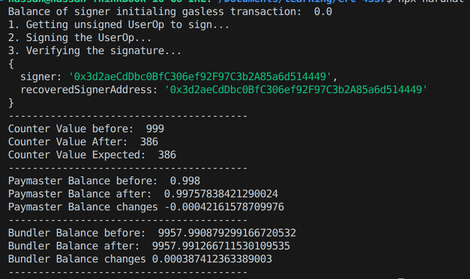
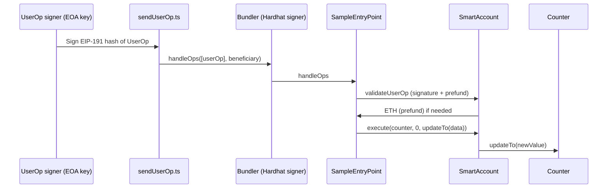

# ERC-4337 Account Abstraction MVP

A minimal **ERC-4337** project: a wallet signs a `UserOperation`, a **bundler** submits it to an **EntryPoint**, and execution updates an on-chain **Counter** while the **user’s EOA pays no gas**. Gas is covered from the smart wallet’s ETH balance (wallet-as-sponsor pattern).

<p align="center">
  
  <br />
  <em>Example output from <code>sendUserOp.ts</code> after a successful run</em>
</p>

---

## What this demonstrates

| Idea | How this repo shows it |
|------|-------------------------|
| **Account abstraction** | User authorizes with a key; execution goes through a **contract account** (`SmartAccount`), not a raw EOA transaction. |
| **ERC-4337 flow** | `PackedUserOperation` → `EntryPoint.handleOps` → `validateUserOp` + execution. |
| **“Gasless” for the signer** | The **user operation signer** can hold **0 ETH**; the **smart wallet** must hold ETH so `_payPreFund` can refund the EntryPoint. |
| **Bundler role** | First Hardhat signer sends `handleOps` and receives the execution **beneficiary** payout. |

---

## Architecture



---

## Tech stack

- **Solidity** `0.8.28` (Cancun), **Hardhat** + **TypeScript**
- **[@account-abstraction/contracts](https://github.com/eth-infinitism/account-abstraction)** (`EntryPoint`, `PackedUserOperation`, interfaces)
- **OpenZeppelin** (`Ownable`, `ECDSA`, `MessageHashUtils`)
- **ethers v6**

---

## Project structure

| Path | Role |
|------|------|
| [`contracts/Counter.sol`](contracts/Counter.sol) | Simple state (`value`) with `updateTo`—target call for the demo. |
| [`contracts/SmartAccount.sol`](contracts/SmartAccount.sol) | Minimal **ERC-4337 account**: `validateUserOp`, ECDSA owner check, `execute`, `_payPreFund` from contract balance. |
| [`contracts/SampleEntryPoint.sol`](contracts/SampleEntryPoint.sol) | Thin wrapper inheriting the canonical **`EntryPoint`** from account-abstraction. |
| [`scripts/deploy.ts`](scripts/deploy.ts) | Deploys EntryPoint / Counter / SmartAccount (skips what’s already in `.env`). |
| [`scripts/sendUserOp.ts`](scripts/sendUserOp.ts) | Builds a `UserOp`, signs with `USER_OP_SIGNER_PRIVATE_KEY`, **`bundler`** calls `handleOps`. |

---

## How it works (short)

1. **SmartAccount** is owned by the **user operation signer** (`USER_OP_SIGNER_PRIVATE_KEY` → address passed as `Ownable` owner at deploy).
2. The script encodes **`execute(counter, 0, counter.updateTo(newValue))`** as `callData`.
3. **`getUserOpHash`** (EIP-712 style via EntryPoint) is signed with **`signMessage(getBytes(hash))`**, matching `_formatHash` + `ECDSA.recover` on-chain.
4. **`handleOps`** runs validation; **`_payPreFund`** pulls ETH from the **smart wallet** so the EntryPoint is prefunded—**this repo treats that wallet as the “paymaster” balance** (not a separate paymaster contract).
5. After validation, the EntryPoint drives **`execute`**, which calls **Counter**.

---

## Assumptions & limitations

- **Sponsorship model:** Gas is paid from the **smart wallet’s balance** via `_payPreFund`. There is **no** standalone paymaster contract in this MVP.
- **Extending:** To use a **dedicated paymaster**, fork the repo and change funding logic (e.g. adjust `_payPreFund` / add paymaster flow per ERC-4337)—this sample keeps the wallet as the sponsor for clarity.
- **Networks:** **`localhost`** (default) and **`sepolia`** are configured in [`hardhat.config.ts`](hardhat.config.ts).

---

## Setup

### 1. Install & compile

```bash
npm install
npm run compile
```

### 2. Environment variables

Create a **`.env`** file (never commit it; it’s gitignored). Typical variables:

| Variable | Used for |
|----------|-----------|
| `RPC_URL` | Sepolia JSON-RPC URL |
| `DEPLOYER_PRIVATE_KEY` | Deployer account on **sepolia** |
| `ETHERSCAN_API_KEY` | Contract verification on Sepolia |
| `USER_OP_SIGNER_PRIVATE_KEY` | Key whose address **must** own the `SmartAccount` (constructor owner) |
| `ENTRYPOINT_ADDRESS` | Set after deploy (or leave empty for first deploy) |
| `COUNTER_ADDRESS` | Set after deploy |
| `SMART_ACCOUNT_ADDRESS` | Set after deploy |

`sendUserOp.ts` requires **`SMART_ACCOUNT_ADDRESS`**, **`COUNTER_ADDRESS`**, **`ENTRYPOINT_ADDRESS`**, and **`USER_OP_SIGNER_PRIVATE_KEY`**.

### 3. Deploy (first time or new network)

```bash
npx hardhat run ./scripts/deploy.ts --network <NETWORK_NAME>
```

Examples:

```bash
npx hardhat run ./scripts/deploy.ts --network localhost
npx hardhat run ./scripts/deploy.ts --network sepolia
```

Copy printed addresses into **`.env`**.

### 4. Fund accounts (important)

- **Smart wallet (`SMART_ACCOUNT_ADDRESS`):** must hold enough ETH for **prefund** and execution accounting (your script logs this as “Paymaster” balance).
- **Bundler / deployer:** on Sepolia, ensure the account that runs `handleOps` and deployment has ETH as needed.

### 5. Run the UserOperation demo

```bash
npx hardhat run ./scripts/sendUserOp.ts --network sepolia
```

On **localhost**, start a node if required, then use `--network localhost` with matching `.env`.

You should see logs similar to [`logs.png`](./logs.png): signature check, counter before/after, smart wallet balance decrease, bundler balance increase.

---

## Verify contracts on Sepolia

Replace addresses with **your** deployed contracts. Constructor args for `SmartAccount` are **`(owner, entryPoint)`** where **`owner`** is the address of `USER_OP_SIGNER_PRIVATE_KEY`.

```bash
# EntryPoint (explicit contract path)
npx hardhat verify <ENTRYPOINT_ADDRESS> \
  --contract contracts/SampleEntryPoint.sol:SampleEntryPoint \
  --network sepolia

# Counter (no constructor args)
npx hardhat verify <COUNTER_ADDRESS> --network sepolia

# SmartAccount — owner then entrypoint
npx hardhat verify <SMART_ACCOUNT_ADDRESS> <OWNER_ADDRESS> <ENTRYPOINT_ADDRESS> --network sepolia
```


---

## Scripts reference

| Command | Description |
|---------|-------------|
| `npm run compile` | Clean + compile contracts |
| `npx hardhat run ./scripts/deploy.ts --network <name>` | Deploy missing contracts and log addresses |
| `npx hardhat run ./scripts/sendUserOp.ts --network <name>` | End-to-end UserOp: sign → `handleOps` → Counter update |

---
